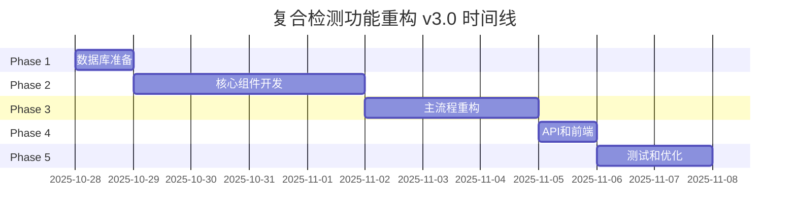

# vistrat 复合检测功能重构方案 v3.0

**版本**: v3.0
**日期**: 2025-10-28
**状态**: ✅ 已批准执行
**目标**: 将"一帧多次AI分析"优化为"一帧一次复合分析"

---

## 📋 目录

1. [重构目标](#一重构目标)
2. [技术架构设计](#二技术架构设计)
3. [数据库设计](#三数据库设计)
4. [核心代码实现](#四核心代码实现)
5. [重构实施步骤](#五重构实施步骤)
6. [关键风险与缓解措施](#六关键风险与缓解措施)
7. [验收标准](#七验收标准)
8. [时间估算](#八时间估算)
9. [执行顺序建议](#九执行顺序建议)
10. [历史教训](#十历史教训从e1ccce40到f42ae5cf的回退分析)

---

## 一、重构目标

### 1.1 核心目标

将"一帧多次AI分析"优化为"一帧一次复合分析"，实现：

- **成本节省**: 67%（3次调用 → 1次调用）
- **时间节省**: 67%（15秒/帧 → 5秒/帧）
- **告警优化**: 一帧多告警，每个违规类型独立写入ES

### 1.2 功能需求

1. **单次AI调用同时检测多种违规类型**
   - 例如：一次调用同时检测"安全帽+反光衣+吸烟"

2. **一帧多告警独立写入**
   - 一个关键帧检测到2种告警类型 → 分别写入2条ES alert记录
   - video_alerts索引结构无需改造

3. **按任务配置触发**
   - API参数控制：`enable_composite=true/false`
   - 前端UI提供开关（参考上次Transfer组件设计）

4. **仅复合检测模式**
   - 完全替换现有的"一帧多次分析"逻辑
   - 不保留双模式并存（降低维护成本）

### 1.3 设计原则（吸取上次失败教训）

1. ✅ **单一职责**: 每个模块职责清晰
2. ✅ **正确的资源管理**: 统一使用DatabaseManager连接池
3. ✅ **避免提示词污染**: 复合检测使用独立的提示词构建流程
4. ✅ **充分的错误处理**: 多层降级机制
5. ✅ **保持索引结构不变**: video_alerts索引无需迁移
6. ✅ **代码简洁**: 每个文件 < 600行

---

## 二、技术架构设计

### 2.1 核心组件（5个新增组件）

```
1. detection_type_templates 表 (数据库)
   - 存储12种预定义检测类型模板

2. CompositeDetectionService (新增)
   - 负责复合检测的编排逻辑
   - 依赖注入DatabaseManager

3. PromptTemplateEngine (新增)
   - 动态组装复合提示词
   - 从detection_type_templates读取模板

4. CompositeResponseParser (新增)
   - 解析AI返回的多违规JSON响应
   - 健壮的错误处理和降级

5. AlertDispatcher (新增)
   - 一帧多告警分发器
   - 每个违规类型独立写入ES
```

### 2.2 调用流程图

```
POST /video-files/{id}/analysis/start?enable_composite=true
    ↓
VideoAnalysisService.start_analysis(enable_composite=True)
    ↓
_execute_task()
    ↓
_analyze_single_frame_composite()  # 新方法
    ↓
CompositeDetectionService.analyze_frame()
    ├→ PromptTemplateEngine.build_prompt(template_ids)
    │   └→ 查询 detection_type_templates 表
    ├→ UnifiedAIClient.analyze_image()  # 一次AI调用
    └→ CompositeResponseParser.parse()
    ↓
AlertDispatcher.dispatch_multi_alerts()  # 拆分为N条alert
    ↓
ES存储: video_frame_results (1条) + video_alerts (N条)
```

### 2.3 数据流示例

#### 输入（一帧，3个算法）
```python
templates = [
    {
        'id': 'tpl-001',
        'name': '未佩戴安全帽',
        'detection_type_code': 'safety_helmet'
    },
    {
        'id': 'tpl-002',
        'name': '未穿反光衣',
        'detection_type_code': 'reflective_vest'
    },
    {
        'id': 'tpl-003',
        'name': '吸烟行为',
        'detection_type_code': 'smoking'
    }
]
```

#### 复合提示词（动态组装）
```
你是一个专业的视频监控分析助手。请仔细观察图片，同时检测以下违规类型：

### 1. 未佩戴安全帽
请仔细观察画面中的所有人员，判断是否有人员未佩戴安全帽...

### 2. 未穿反光衣
请观察画面中的工作人员是否穿着反光衣...

### 3. 吸烟行为
请检测画面中是否有人员正在吸烟...

请严格按照以下JSON格式返回结果：
{
  "violations": [
    {
      "safety_helmet": {
        "has_violation": true/false,
        "confidence": 0.0-1.0,
        "conclusion": "详细结论",
        "violation_count": 整数
      }
    },
    ...
  ]
}
```

#### AI响应（一次调用）
```json
{
  "violations": [
    {
      "safety_helmet": {
        "has_violation": true,
        "confidence": 0.92,
        "conclusion": "发现1名工作人员未佩戴安全帽，位于画面左侧",
        "violation_count": 1
      }
    },
    {
      "reflective_vest": {
        "has_violation": false,
        "confidence": 0.88,
        "conclusion": "所有人员均正确穿着反光衣"
      }
    },
    {
      "smoking": {
        "has_violation": false,
        "confidence": 0.75,
        "conclusion": "未检测到吸烟行为"
      }
    }
  ]
}
```

#### 告警写入ES（2条，只写has_violation=true）
```
video_alerts 索引:
1. {
     "task_id": "xxx",
     "frame_index": 150,
     "template_name": "未佩戴安全帽",
     "detection_type_code": "safety_helmet",
     "confidence": 0.92,
     "description": "发现1名工作人员未佩戴安全帽",
     "severity": "high"
   }
```

---

## 三、数据库设计

### 3.1 新增表: detection_type_templates

```sql
CREATE TABLE public.detection_type_templates (
    id UUID PRIMARY KEY DEFAULT gen_random_uuid(),
    type_code VARCHAR(50) UNIQUE NOT NULL,  -- 如 'safety_helmet'
    display_name VARCHAR(100) NOT NULL,      -- 如 '安全帽检测'
    category VARCHAR(50) NOT NULL,           -- safety/behavior/environment
    prompt_template TEXT NOT NULL,           -- 提示词模板
    json_field_name VARCHAR(50) NOT NULL,    -- AI响应中的字段名
    severity VARCHAR(20) DEFAULT 'medium',   -- low/medium/high
    sort_order INTEGER DEFAULT 0,            -- 在复合提示词中的顺序
    enabled BOOLEAN DEFAULT TRUE,
    created_at TIMESTAMP DEFAULT NOW()
);
```

**预置12种检测类型**:
1. safety_helmet - 未佩戴安全帽
2. reflective_vest - 未穿反光衣
3. smoking - 吸烟行为
4. work_uniform - 未穿工装
5. safety_harness - 高处作业未系安全带
6. climbing - 攀爬危险高处
7. phone_usage - 工作时玩手机
8. sleeping_on_duty - 睡岗或趴桌
9. absence_from_post - 离岗脱岗
10. intrusion - 非法入侵
11. fire_smoke - 火灾烟雾
12. water_accumulation - 地面积水

### 3.2 修改表: video_analysis_template

```sql
-- 新增字段（标记哪些算法使用复合检测）
ALTER TABLE video_analysis_template ADD COLUMN detection_type_code VARCHAR(50);
ALTER TABLE video_analysis_template ADD FOREIGN KEY (detection_type_code)
    REFERENCES detection_type_templates(type_code);

-- 迁移策略：现有算法保持prompt_content，detection_type_code为NULL（兼容）
```

---

## 四、核心代码实现

### 4.1 PromptTemplateEngine

**文件**: `backend/prompts/composite_prompt_engine.py`

**职责**: 动态组装复合提示词

**关键方法**:
```python
class PromptTemplateEngine:
    def __init__(self, db_pool):
        self.db_pool = db_pool  # 依赖注入
        self._cache = {}  # Redis缓存模板

    async def build_composite_prompt(self, type_codes: List[str]) -> str:
        """组装复合提示词"""
        # 1. 查询模板（优先缓存）
        # 2. 按sort_order排序
        # 3. 拼接提示词
        # 4. 构建JSON schema
```

**要点**:
- 使用DatabaseManager统一连接池
- Redis缓存模板减少DB查询
- 限制同时检测类型 ≤ 5个（防止token超限）

### 4.2 CompositeResponseParser

**文件**: `backend/parsers/composite_response_parser.py`

**职责**: 解析AI多违规JSON响应

**关键方法**:
```python
class CompositeResponseParser:
    async def parse_composite_response(
        self,
        ai_response: str,
        expected_types: List[str]
    ) -> List[Dict]:
        """
        解析AI响应，返回violations列表

        Returns:
            [
                {
                    'type_code': 'safety_helmet',
                    'has_violation': True,
                    'confidence': 0.92,
                    'conclusion': '...',
                    'severity': 'high'
                },
                ...
            ]
        """
```

**降级策略**（3层）:
1. 尝试解析 ```json...``` 代码块
2. 尝试直接JSON.parse
3. 关键词匹配降级

### 4.3 CompositeDetectionService

**文件**: `backend/services/composite_detection_service.py`

**职责**: 复合检测编排服务

**关键方法**:
```python
class CompositeDetectionService:
    def __init__(
        self,
        prompt_engine: PromptTemplateEngine,
        ai_client: UnifiedAIClient,
        response_parser: CompositeResponseParser
    ):
        ...

    async def analyze_frame_composite(
        self,
        image_path: str,
        template_configs: List[Dict],
        model_config_id: str
    ) -> Dict:
        """复合检测分析一帧"""
```

### 4.4 AlertDispatcher

**文件**: `backend/services/alert_dispatcher.py`

**职责**: 一帧多告警分发

**关键方法**:
```python
class AlertDispatcher:
    async def dispatch_alerts(
        self,
        task_id: str,
        frame_index: int,
        violations: List[Dict],
        image_url: str
    ):
        """一帧N个违规 → 写入N条alert"""
        for violation in violations:
            if not violation.get('has_violation'):
                continue

            # 写入ES video_alerts索引
            await self.es_service.store_alert({...})

            # WebSocket实时推送
            await self.alert_service.broadcast_alert({...})
```

---

## 五、重构实施步骤（12步）

### Phase 1: 数据库准备（2步）

#### **Step 1.1** ✅ - 创建detection_type_templates表
- 文件: `backend/database/migrations/add_composite_detection_tables.sql`
- 预置12种检测类型数据
- 执行迁移脚本

#### **Step 1.2** - 验证数据库迁移
- 连接PostgreSQL
- 执行迁移脚本
- 验证12条预置数据

### Phase 2: 核心组件开发（4步）

#### **Step 2.1** - 实现PromptTemplateEngine
- 文件: `backend/prompts/composite_prompt_engine.py`
- 包含缓存机制
- 单元测试覆盖率 > 90%

#### **Step 2.2** - 实现CompositeResponseParser
- 文件: `backend/parsers/composite_response_parser.py`
- JSON解析 + 3层降级逻辑
- Mock测试各种AI响应格式

#### **Step 2.3** - 实现CompositeDetectionService
- 文件: `backend/services/composite_detection_service.py`
- 依赖注入设计
- 集成测试

#### **Step 2.4** - 实现AlertDispatcher
- 文件: `backend/services/alert_dispatcher.py`
- 一帧多告警分发
- ES批量写入优化

### Phase 3: 主流程重构（3步）

#### **Step 3.1** - 重构VideoAnalysisService
- 修改`start_analysis()`：新增`enable_composite`参数
- 新增`_analyze_single_frame_composite()`方法
- 替换原有的`_analyze_single_frame()`调用

#### **Step 3.2** - 修改UnifiedAIClient
- 支持`custom_system_prompt`参数
- 正确处理`skip_format_enhancement=True`
- 不破坏现有封装

#### **Step 3.3** - 修改AnalysisResultProcessor
- 适配复合检测结果格式
- 调用AlertDispatcher分发告警

### Phase 4: API和前端（2步）

#### **Step 4.1** - 修改API接口
- `POST /video-files/{id}/analysis/start?enable_composite=true`
- 更新Swagger文档
- 参数验证

#### **Step 4.2** - 前端UI支持（参考上次Transfer组件）
- VideoManagementPage添加复合检测配置
- 使用Ant Design Transfer组件选择检测类型
- 默认值：true（推荐使用）

### Phase 5: 测试和优化（1步）

#### **Step 5.1** - 全链路测试
- 单元测试（覆盖率 > 85%）
- 集成测试（完整视频分析流程）
- 性能测试（对比单违规模式）
- 错误场景测试（AI响应异常、数据库故障等）

---

## 六、关键风险与缓解措施

### 风险矩阵

| 风险点 | 概率 | 影响 | 等级 | 缓解措施 |
|--------|------|------|------|----------|
| AI响应格式不稳定 | 高 | 高 | 🔴 | 3层降级 + Schema验证 |
| 提示词Token超限 | 中 | 高 | 🟠 | 限制≤5种类型 + 监控 |
| DB连接池管理混乱 | 低 | 高 | 🟠 | 统一DatabaseManager |
| 无法回滚到单违规 | 中 | 中 | 🟡 | Git标记 + 注释保留原代码 |
| 性能优化不明显 | 中 | 中 | 🟡 | Benchmark对比 |

### 详细缓解措施

#### 风险1: AI响应格式不稳定 🔴
**缓解**:
- CompositeResponseParser实现3层降级
- 提示词中明确JSON schema要求
- 记录解析失败的AI响应用于模型优化
- 监控解析成功率（目标 > 95%）

#### 风险2: 提示词Token超限 🟠
**缓解**:
- 限制单次复合检测 ≤ 5种类型
- 前端UI提示推荐组合
- 监控token使用量
- 提示词压缩技术（去除冗余）

#### 风险3: 数据库连接池管理混乱 🟠
**缓解**（上次失败的核心教训）:
- 统一使用`DatabaseManager.get_pool()`
- 避免创建独立连接池（如asyncpg_helper.py）
- 连接泄漏监控
- PromptTemplateEngine通过依赖注入获取pool

#### 风险4: 无法回滚到单违规模式 🟡
**缓解**:
- 保留原始`_analyze_single_frame()`代码（注释掉）
- Git标记回滚点：`git tag rollback-point-v2.2`
- 灰度发布策略
- 紧急回滚脚本

---

## 七、验收标准

### 7.1 功能验收

- ✅ 单次AI调用同时检测多种违规类型
- ✅ 一帧2种违规 → ES写入2条alert记录
- ✅ API参数`enable_composite=true`正确生效
- ✅ 前端UI Transfer组件选择检测类型正常工作
- ✅ video_alerts索引结构无变化（向后兼容）

### 7.2 性能验收

- ✅ 成本节省 ≥ 60%（AI调用次数减少）
- ✅ 分析速度提升 ≥ 50%
- ✅ 准确率下降 ≤ 5%
- ✅ 解析成功率 > 95%

### 7.3 代码质量验收

- ✅ 单个文件 < 600行
- ✅ 测试覆盖率 > 85%
- ✅ 无循环依赖
- ✅ 通过代码审查
- ✅ 无数据库连接泄漏
- ✅ 无提示词污染问题

### 7.4 稳定性验收

- ✅ 错误降级机制生效
- ✅ 数据库故障不影响服务
- ✅ AI响应异常有合理降级
- ✅ 连续运行24小时无内存泄漏

---

## 八、时间估算

| 阶段 | 工作量 | 风险缓冲 | 总计 |
|------|--------|----------|------|
| Phase 1: 数据库准备 | 0.5天 | 0.2天 | 0.7天 |
| Phase 2: 核心组件开发 | 3天 | 1天 | 4天 |
| Phase 3: 主流程重构 | 2天 | 0.5天 | 2.5天 |
| Phase 4: API和前端 | 1天 | 0.3天 | 1.3天 |
| Phase 5: 测试和优化 | 1.5天 | 0.5天 | 2天 |
| **总计** | **8天** | **2.5天** | **10.5天** |

**实际估算**: 约 **2个工作周**（含充分测试和风险缓冲）

---

## 九、执行顺序建议

### 9.1 开发顺序

1. **先数据库，后代码** - 确保数据层稳定
2. **自底向上开发** - PromptEngine → Parser → Service → API
3. **充分测试后集成** - 每个组件独立验证
4. **小步提交** - 每个Step独立commit
5. **保持可回滚** - 关键节点打tag

### 9.2 Git提交策略

```bash
# Phase 1
git commit -m "feat: 创建detection_type_templates表和迁移脚本"
git commit -m "feat: 修改video_analysis_template表支持复合检测"

# Phase 2
git commit -m "feat: 实现PromptTemplateEngine核心组件"
git commit -m "feat: 实现CompositeResponseParser解析器"
git commit -m "feat: 实现CompositeDetectionService服务"
git commit -m "feat: 实现AlertDispatcher告警分发器"

# Phase 3
git commit -m "refactor: 重构VideoAnalysisService支持复合检测"
git commit -m "refactor: 修改UnifiedAIClient支持自定义提示词"
git commit -m "refactor: 修改AnalysisResultProcessor适配复合检测"

# Phase 4
git commit -m "feat: API接口支持enable_composite参数"
git commit -m "feat: 前端UI支持复合检测配置（Transfer组件）"

# Phase 5
git commit -m "test: 添加复合检测完整测试套件"
git commit -m "docs: 更新复合检测功能文档"

# 最终标记
git tag v3.0.0-composite-detection
```

---

## 十、历史教训（从e1ccce40到f42ae5cf的回退分析）

### 10.1 上次失败的核心原因

**时间**: 2025年10月19日 08:16 - 15:15（7小时内10个连续修复）

**提交统计**:
- 新增代码: 4650行
- 修复提交: 10个
- 最终结果: 完全回退（Revert）

**失败原因**:

1. **架构设计过度复杂** 🔴
   - 新增6层调用链
   - CompositePromptBuilder + MultiViolationParser + detection_types API
   - 代码增量过大（4650行）

2. **资源管理混乱** 🔴
   - 紧急创建`asyncpg_helper.py`独立连接池
   - DatabaseManager.pool混用
   - 连接池泄漏风险

3. **破坏现有封装** 🟠
   - 添加`skip_format_enhancement`参数
   - 提示词污染问题
   - UnifiedAIClient设计理念冲突

4. **双模式维护成本高** 🟠
   - 复合检测 + 单违规检测并存
   - 双路由逻辑复杂
   - 测试复杂度翻倍

5. **前端UX复杂** 🟡
   - Form表单类型错误（composite_detection: boolean → string）
   - Transfer组件配置困难
   - 数据流管理混乱

### 10.2 本次重构的改进措施

| 问题 | 上次方案 | 本次改进 |
|------|----------|----------|
| 架构复杂度 | 6层调用链，4650行代码 | 5个简洁组件，预估<2000行 |
| 连接池管理 | 紧急创建asyncpg_helper | 统一DatabaseManager，依赖注入 |
| 提示词污染 | skip_format_enhancement标记 | custom_system_prompt参数 |
| 双模式维护 | 复合+单违规并存 | 仅复合检测（简化） |
| 前端复杂度 | Transfer+Form混乱 | 参考上次设计，改进数据流 |

### 10.3 关键经验总结

**DO ✅**:
- 先写详细设计文档，再动手编码
- 统一使用DatabaseManager管理连接
- 每个组件独立测试后再集成
- 小步提交，保持可回滚
- 充分的错误处理和降级

**DON'T ❌**:
- 不要紧急创建独立的资源管理模块（如asyncpg_helper）
- 不要破坏现有组件的封装性（如UnifiedAIClient）
- 不要追求过度灵活的架构（如detection_types API）
- 不要在同一天内连续修复10个bug（说明设计有问题）
- 不要忽视向后兼容性测试

---

## 十一、成功标准

### 11.1 技术指标

- ✅ AI调用次数减少 ≥ 60%
- ✅ 分析速度提升 ≥ 50%
- ✅ 准确率下降 ≤ 5%
- ✅ 代码增量 < 2000行
- ✅ 测试覆盖率 > 85%

### 11.2 质量指标

- ✅ 无数据库连接泄漏
- ✅ 无内存泄漏（24小时运行）
- ✅ 无提示词污染问题
- ✅ 无循环依赖
- ✅ 代码审查通过

### 11.3 用户体验指标

- ✅ 前端配置简单易用
- ✅ 错误提示清晰
- ✅ API响应时间 < 10秒
- ✅ 告警推送实时性 < 2秒

---

## 十二、项目里程碑



---

## 十三、联系与支持

**技术负责人**: AI Watchdog Team
**文档版本**: v3.0
**最后更新**: 2025-10-28

**相关文档**:
- [系统架构文档](./CLAUDE.md)
- [API文档](./API.md)
- [设计模式分析](./DESIGN_PATTERNS_ANALYSIS.md)

---

**⚠️ 重要提醒**:
1. 严格按照本方案执行，不得跳步
2. 每个Phase完成后进行阶段性验收
3. 发现问题立即记录，不要带着问题继续开发
4. 保持代码简洁，单个文件不超过600行
5. 充分测试后再提交，避免连续修复（上次教训）

**✅ 方案已批准，可以开始执行！**
