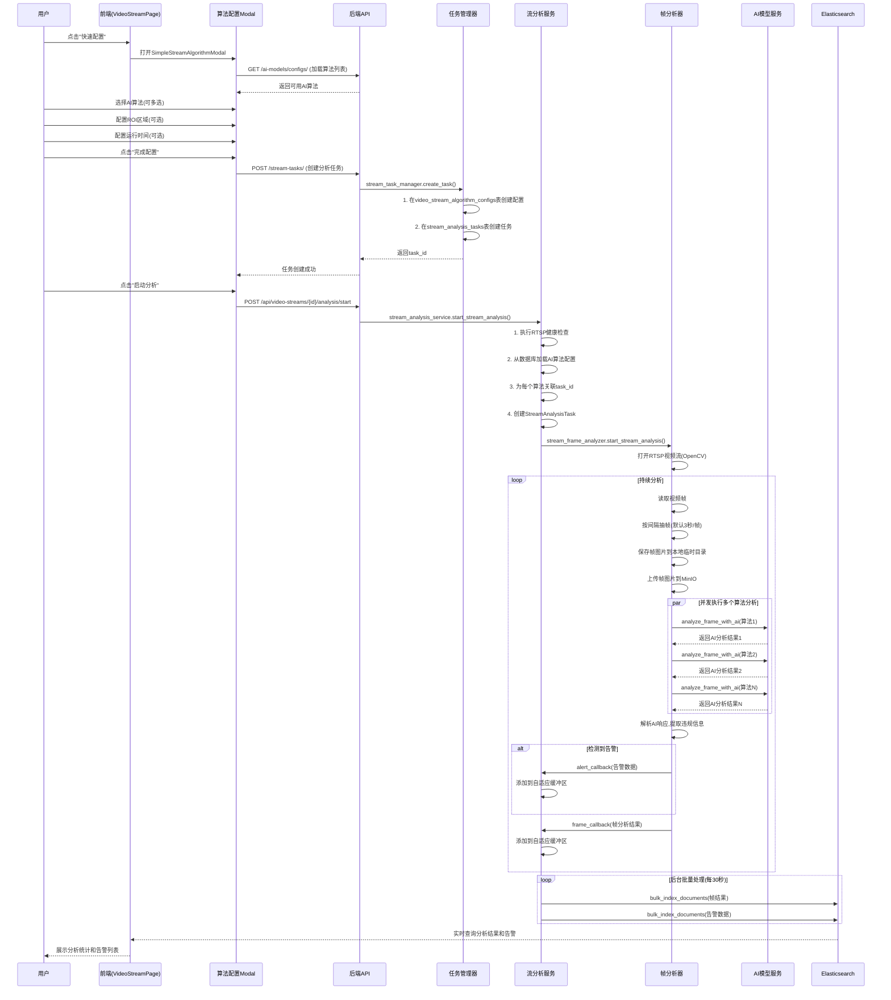
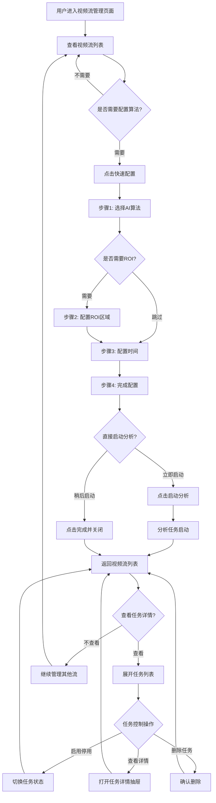
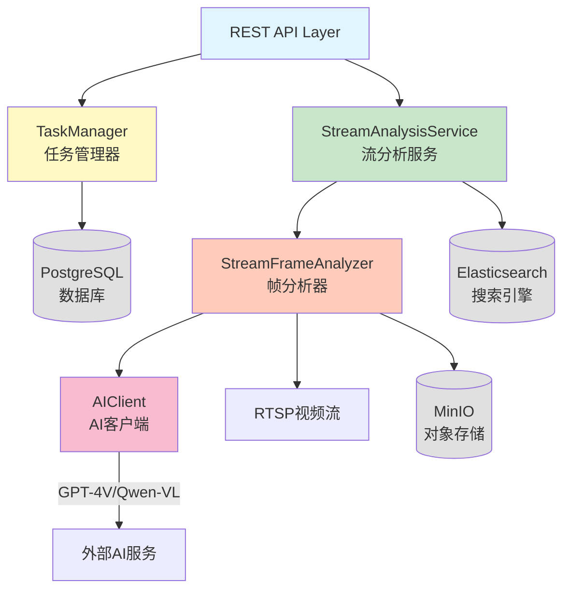
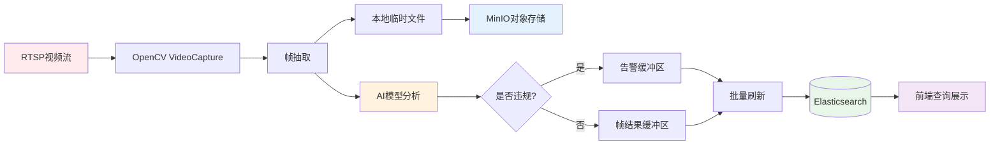
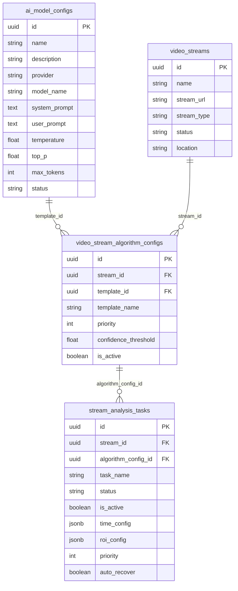

# 实时视频流AI分析核心逻辑技术文档

> **系统版本**: v2.2.0
> **文档类型**: 技术架构深度分析
> **更新时间**: 2025-10-13
> **作者**: Claude AI Technical Analysis

---

## 📋 目录

1. [系统概述](#系统概述)
2. [完整业务流程](#完整业务流程)
3. [前端交互层](#前端交互层)
4. [后端服务层](#后端服务层)
5. [核心技术栈](#核心技术栈)
6. [设计模式应用](#设计模式应用)
7. [性能优化技术](#性能优化技术)
8. [数据流转分析](#数据流转分析)
9. [关键代码模块](#关键代码模块)

---

## 系统概述

### 系统定位
本系统是一个基于多模态AI视觉模型的企业级实时视频流智能分析平台,专注于RTSP视频流的实时监控和智能告警。

### 核心能力
- **多流并发处理**: 支持多路RTSP视频流同时分析
- **智能算法配置**: 可视化配置多个AI分析算法
- **ROI区域检测**: 支持矩形和多边形感兴趣区域
- **时间调度控制**: 支持按时间段和星期控制分析任务
- **实时告警推送**: 毫秒级告警检测和WebSocket推送
- **自适应缓冲**: 智能缓冲区管理,优化性能和资源消耗

---

## 完整业务流程

### 流程图



### 流程说明

#### 阶段1: 算法快速配置 (前端)
**入口**: `VideoStreamPage.tsx:626` → `handleConfigure(record)`

**组件**: `SimpleStreamAlgorithmModal.tsx`

**步骤**:
1. **算法选择步骤** (`currentStep='algorithm'`)
   - 加载激活状态的AI算法: `GET /api/ai-models/configs/`
   - 用户选择一个或多个AI算法
   - 展示算法详细信息(名称、描述、提供商、模型名称、标签)

2. **ROI配置步骤** (`currentStep='roi'`)
   - 获取视频流快照
   - 支持矩形框绘制: 鼠标拖拽
   - 支持多边形绘制: 点击添加顶点
   - 每个流只能设置一个ROI区域
   - 可选步骤,可跳过

3. **时间配置步骤** (`currentStep='schedule'`)
   - 为每个算法独立配置运行时间
   - 支持启用/停用时间控制
   - 配置时间范围: 开始时间、结束时间
   - 配置运行日期: 周一到周日可选
   - 默认时区: Asia/Shanghai

4. **配置完成** (`currentStep='ready'`)
   - 展示配置摘要
   - 可修改配置或启动分析

#### 阶段2: 任务创建 (后端数据库)
**API**: `POST /stream-tasks/` (定义在 `stream_tasks.py:109`)

**处理器**: `stream_task_manager.create_task()` (`stream_task_manager.py:236`)

**数据库操作**:

1. **创建算法配置记录** (video_stream_algorithm_configs表)
```python
stream_algorithm_config_id = uuid.uuid4()
INSERT INTO video_stream_algorithm_configs (
    id, stream_id, template_id, template_name, priority,
    confidence_threshold, is_active, created_at, updated_at
) VALUES (...)
```

2. **创建分析任务记录** (stream_analysis_tasks表)
```python
task_id = uuid.uuid4()
INSERT INTO stream_analysis_tasks (
    id, stream_id, algorithm_config_id, task_name, status,
    is_active, time_config, roi_config, priority,
    confidence_threshold, analysis_interval, auto_recover, created_at
) VALUES (...)
```

3. **数据库表结构说明**:
   - `ai_model_configs`: 存储AI算法的基础配置(prompt、模型参数等)
   - `video_stream_algorithm_configs`: 存储视频流与AI算法的关联配置
   - `stream_analysis_tasks`: 存储具体的分析任务配置和状态

**表关系**:
```
ai_model_configs (AI算法基础配置)
    ↓ (template_id外键)
video_stream_algorithm_configs (流-算法关联配置)
    ↓ (algorithm_config_id外键)
stream_analysis_tasks (分析任务)
```

#### 阶段3: 启动分析 (后端服务)
**API**: `POST /api/video-streams/{id}/analysis/start` (定义在前端 `SimpleStreamAlgorithmModal.tsx:289`)

实际后端处理路由需要在 `api/streams.py` 或类似文件中定义,然后调用:

**服务**: `stream_analysis_service.start_stream_analysis()` (`stream_analysis_service.py:78`)

**启动流程**:

1. **健康检查**
```python
is_healthy, error_message, stream_info = rtsp_health_checker.check_rtsp_stream(
    rtsp_url, timeout=10
)
```
   - 验证RTSP流是否可连接
   - 获取流信息(分辨率、FPS)
   - 失败时返回友好的错误提示和修复建议

2. **加载算法配置**
```python
# 从video_stream_algorithm_configs查询已配置的算法
analysis_config = await VideoStreamService.get_analysis_templates(stream_id)

# 从ai_model_configs表查询算法详细配置
for template_config in analysis_config['templates']:
    template = await db.execute("""
        SELECT name, description, provider, model_name,
               system_prompt, user_prompt, temperature, top_p, max_tokens
        FROM ai_model_configs
        WHERE id = :template_id
    """)
```

3. **关联任务ID**
```python
# 查询stream_analysis_tasks,为每个算法关联其task_id
for template in templates:
    result = await db.execute("""
        SELECT sat.id as task_id
        FROM video_stream_algorithm_configs vsac
        JOIN stream_analysis_tasks sat ON vsac.id = sat.algorithm_config_id
        WHERE vsac.stream_id = :stream_id
          AND vsac.template_id = :template_id
          AND vsac.is_active = true
          AND sat.is_active = true
    """)
    template['task_id'] = row['task_id']
```

4. **创建分析任务对象**
```python
task = StreamAnalysisTask(
    task_id=f"stream_task_{stream_id}_{timestamp}",
    stream_id=stream_id,
    stream_name=stream_name,
    rtsp_url=rtsp_url,
    template_ids=[...],
    status="running",
    started_at=now()
)
```

5. **启动帧分析器**
```python
session_id = await stream_frame_analyzer.start_stream_analysis(
    rtsp_url=rtsp_url,
    stream_id=stream_id,
    templates=templates,  # 包含task_id的完整配置
    frame_callback=self._handle_frame_result,
    alert_callback=self._handle_alert
)
```

#### 阶段4: 实时帧分析 (核心处理)
**服务**: `stream_frame_analyzer._analyze_stream_continuously()` (`stream_frame_analyzer.py:117`)

**处理流程**:

1. **打开RTSP流**
```python
cap = cv2.VideoCapture(rtsp_url)
cap.set(cv2.CAP_PROP_BUFFERSIZE, 1)  # 减少延迟
fps = cap.get(cv2.CAP_PROP_FPS) or 25
frame_interval = int(fps * 3.0)  # 每3秒抽一帧
```

2. **持续读取视频帧**
```python
while self.is_analyzing:
    ret, frame = cap.read()
    if not ret:
        # 尝试重连
        cap = cv2.VideoCapture(rtsp_url)
        continue

    frame_count += 1

    # 检查是否需要分析此帧
    if frame_count % frame_interval == 0:
        asyncio.create_task(self._analyze_frame_async(...))
```

3. **异步分析单帧** (`_analyze_frame_async`)
```python
# 1. 保存帧图片
frame_path = temp_dir / f"stream_frame_{frame_index:06d}.jpg"
await loop.run_in_executor(self.thread_pool, cv2.imwrite, str(frame_path), frame)

# 2. 上传到MinIO
minio_url = await storage_service.upload_stream_frame_image(
    str(frame_path), stream_id, frame_index
)

# 3. 并发执行多个算法分析
analysis_tasks = []
for template in templates:
    task = asyncio.create_task(
        self._analyze_single_template(frame_path, frame_index, timestamp,
                                       stream_id, template, minio_url, alert_callback)
    )
    analysis_tasks.append(task)

analysis_results = await asyncio.gather(*analysis_tasks, return_exceptions=True)
```

4. **单个算法分析** (`_analyze_single_template`)
```python
# AI分析
analysis_result = await self.frame_analyzer.analyze_frame_with_ai(
    image_path=str(frame_path),
    prompt=template['prompt_content'],
    model_config_id=template['template_id']
)

# 解析违规信息
has_alert = self._extract_violation_from_ai_response(
    analysis_result.get('ai_response', '')
)

# 构建帧分析结果
frame_result = {
    'task_id': template.get('task_id'),  # 关联的任务ID
    'stream_id': stream_id,
    'frame_index': frame_index,
    'template_id': template['id'],
    'template_name': template['name'],
    'has_alert': has_alert,
    'image_url': minio_url,
    'ai_response': analysis_result.get('ai_response'),
    'confidence': analysis_result.get('confidence'),
    ...
}

# 如果有告警,执行告警回调
if has_alert and alert_callback:
    alert_callback(alert_data)

return frame_result
```

5. **AI违规检测逻辑**
```python
def _extract_violation_from_ai_response(self, ai_response: str) -> bool:
    # 1. 尝试解析JSON格式
    json_match = re.search(r'```json\s*(\{.*?\})\s*```', ai_response, re.DOTALL)
    if json_match:
        response_data = json.loads(json_match.group(1))
        if 'has_violation' in response_data:
            return bool(response_data['has_violation'])

    # 2. 降级到关键词检查
    violation_keywords = [
        'has_violation": true', '"has_violation":true',
        '违规', '违反', '异常', 'violation', 'alert'
    ]
    return any(keyword in ai_response.lower() for keyword in violation_keywords)
```

#### 阶段5: 缓冲与持久化 (性能优化)
**服务**: `stream_analysis_service` 缓冲区管理

**自适应缓冲机制**:

1. **数据收集**
```python
def _handle_frame_result(self, frame_result: Dict[str, Any]):
    stream_id = frame_result.get('stream_id')

    # 使用自适应缓冲区管理器
    buffer_key = f"frame_results_{stream_id}"
    adaptive_buffer_manager.add_item(buffer_key, frame_result)

    # 更新系统负载
    active_streams = len([t for t in self.running_tasks.values()
                          if t.status == "running"])
    adaptive_buffer_manager.update_system_load(active_streams)
```

2. **后台批量处理** (`_batch_process_results`)
```python
while True:
    await asyncio.sleep(30)  # 每30秒刷新一次

    for stream_id in list(self._frame_results_buffer.keys()):
        frame_buffer_size = len(self._frame_results_buffer.get(stream_id, []))

        # 超过阈值立即处理
        if frame_buffer_size >= 50:  # 缓冲区阈值
            await self._flush_buffered_data(stream_id)
```

3. **自适应刷新回调** (`_adaptive_flush_callback`)
```python
async def _adaptive_flush_callback(self, buffer_key: str, items: List[Dict]):
    if buffer_key.startswith("frame_results_"):
        stream_id = buffer_key.replace("frame_results_", "")
        await self._save_frame_results_to_elasticsearch(stream_id, items)

    elif buffer_key.startswith("alerts_"):
        stream_id = buffer_key.replace("alerts_", "")
        await self._save_alerts_to_elasticsearch(stream_id, items)
```

4. **批量保存到Elasticsearch**
```python
async def _save_frame_results_to_elasticsearch(self, stream_id, frame_results):
    documents = []
    for result in frame_results:
        doc = {
            'task_id': result.get('task_id'),
            'stream_id': stream_id,
            'frame_index': result.get('frame_index'),
            'template_name': result.get('template_name'),
            'has_alert': result.get('has_alert'),
            'image_url': result.get('image_url'),
            'ai_response': result.get('ai_response'),
            'confidence': round(result.get('confidence', 0.0), 2),
            'created_at': now_isoformat(),
            'data_type': 'stream_frame_result'
        }
        documents.append(doc)

    # 统一使用video_frame_results索引
    await elasticsearch_service.bulk_index_documents('video_frame_results', documents)
```

5. **告警数据增强**
```python
async def _save_alerts_to_elasticsearch(self, stream_id, alerts):
    for alert in alerts:
        # 获取流信息
        stream_info = await self._get_stream_info(stream_id)

        # 计算视频时间
        frame_index = alert.get('frame_index', 0)
        video_seconds = frame_index / 15
        minutes, seconds = int(video_seconds // 60), int(video_seconds % 60)
        video_time = f"{minutes:02d}:{seconds:02d}"

        # 确定严重程度
        confidence = round(alert.get('confidence', 0.0), 2)
        if confidence >= 0.9:
            severity = "critical"
        elif confidence >= 0.7:
            severity = "high"
        elif confidence >= 0.5:
            severity = "medium"
        else:
            severity = "low"

        doc = {
            'task_id': f"stream_{stream_id}",
            'video_id': stream_id,
            'stream_id': stream_id,
            'video_name': stream_info.get('name'),
            'frame_index': frame_index,
            'video_time': video_time,
            'datetime': alert.get('datetime'),
            'algorithm_name': alert.get('algorithm_name'),
            'algorithm_category': alert.get('algorithm_category'),
            'analysis_type': 'stream_analysis',
            'severity': severity,
            'confidence': confidence,
            'alert_content': alert.get('alert_content'),
            'image_url': alert.get('image_url'),
            'resolved': False,
            'created_at': now_isoformat(),
            'data_type': 'stream_alert'
        }
        documents.append(doc)

    # 统一使用video_alerts索引
    await elasticsearch_service.bulk_index_documents('video_alerts', documents)
```

#### 阶段6: 前端展示与监控
**页面**: `VideoStreamPage.tsx`

**展示内容**:
1. **视频流列表**: 展示所有配置的视频流,包含统计信息
2. **任务列表**: 展开查看每个流的分析任务
3. **任务状态**: 实时显示任务运行状态
4. **告警查看**: 点击查看特定流的告警历史
5. **任务控制**: 启用/停用、启动/停止、删除任务

---

## 前端交互层

### 组件架构

#### VideoStreamPage.tsx (主页面)
**位置**: `frontend/src/pages/VideoStreamPage.tsx`

**核心功能**:
```typescript
// 1. 视频流列表管理
const [streams, setStreams] = useState<VideoStream[]>([])
const loadStreams = async (params = {}) => {
  const response = await fetch(`/api/video-streams/`)
  setStreams(data)
}

// 2. 任务列表管理(可展开行)
const [streamTasks, setStreamTasks] = useState<{ [streamId: string]: any[] }>({})
const loadStreamTasks = async (streamId: string) => {
  const response = await fetch(`/stream-tasks/?stream_id=${streamId}`)
  setStreamTasks(prev => ({ ...prev, [streamId]: data }))
}

// 3. 算法配置入口
const handleConfigure = (stream: VideoStream) => {
  setSelectedStream(stream)
  setConfigModalVisible(true)
}

// 4. 任务控制操作
const toggleTaskActive = async (taskId: string, isActive: boolean, streamId: string) => {
  const action = isActive ? 'disable' : 'enable'
  await fetch(`/stream-tasks/${taskId}/${action}`, { method: 'POST' })
  await loadStreamTasks(streamId)
}
```

**表格结构**:
- **主表格**: 视频流列表
- **可展开行**: 显示该流的所有分析任务
- **嵌套表格**: 任务详细信息和控制按钮

#### SimpleStreamAlgorithmModal.tsx (算法配置模态框)
**位置**: `frontend/src/components/stream/SimpleStreamAlgorithmModal.tsx`

**步骤管理**:
```typescript
type Step = 'algorithm' | 'roi' | 'schedule' | 'ready' | 'analyzing'
const [currentStep, setCurrentStep] = useState<Step>('algorithm')
```

**核心状态**:
```typescript
// 算法选择
const [algorithms, setAlgorithms] = useState<AIAlgorithm[]>([])
const [selectedAlgorithms, setSelectedAlgorithms] = useState<string[]>([])

// ROI配置
const [currentROI, setCurrentROI] = useState<ROIRegion | null>(null)
const [currentSnapshot, setCurrentSnapshot] = useState<string | null>(null)
const [roiDrawMode, setRoiDrawMode] = useState<'rectangle' | 'polygon'>('rectangle')

// 时间配置
const [scheduleConfig, setScheduleConfig] = useState<{
  [algorithmId: string]: {
    enabled: boolean
    timeRanges: Array<{
      startTime: string
      endTime: string
      days: number[]
    }>
  }
}>({})
```

**关键方法**:

1. **保存配置** (`handleSaveConfig` - 第183行)
```typescript
const handleSaveConfig = async () => {
  const algorithmIds = selectedAlgorithms

  // 为每个算法创建独立的分析任务
  for (const algorithmId of algorithmIds) {
    const taskData = {
      stream_id: stream.id,
      algorithm_config_id: algorithmId,
      task_name: `${stream.name}_${algorithmId}_分析任务`,
      time_config: {
        enabled: scheduleConfig[algorithmId]?.enabled || false,
        time_ranges: scheduleConfig[algorithmId]?.timeRanges || [...]
      },
      roi_config: {
        enabled: Boolean(currentROI),
        regions: currentROI ? [currentROI] : []
      },
      priority: 1,
      confidence_threshold: 0.7,
      analysis_interval: 10,
      auto_recover: true
    }

    const response = await fetch('/api/stream-tasks/', {
      method: 'POST',
      headers: { 'Content-Type': 'application/json' },
      body: JSON.stringify(taskData)
    })
  }

  setCurrentStep('ready')
  onConfirm()
}
```

2. **启动分析** (`startAnalysis` - 第285行)
```typescript
const startAnalysis = async () => {
  const response = await fetch(`/api/video-streams/${stream.id}/analysis/start`, {
    method: 'POST'
  })

  if (response.ok) {
    message.success('分析任务已启动')
  }
}
```

3. **ROI绘制** (矩形模式)
```typescript
const handleMouseDown = (e: React.MouseEvent<HTMLCanvasElement>) => {
  const rect = canvas.getBoundingClientRect()
  const x = (e.clientX - rect.left) / scaleFactor.x
  const y = (e.clientY - rect.top) / scaleFactor.y

  if (roiDrawMode === 'rectangle') {
    setIsDrawing(true)
    setStartPoint({ x, y })
  }
}

const handleMouseUp = (e: React.MouseEvent<HTMLCanvasElement>) => {
  // 计算矩形区域
  const newROI: ROIRegion = {
    id: `rectangle_${Date.now()}`,
    type: 'rectangle',
    name: '矩形ROI',
    data: { x, y, width, height }
  }
  setCurrentROI(newROI)
  message.success('矩形ROI区域已设置完成')
}
```

4. **ROI绘制** (多边形模式)
```typescript
const handleMouseDown = (e: React.MouseEvent<HTMLCanvasElement>) => {
  if (roiDrawMode === 'polygon') {
    const newPoint = { x, y }

    if (!isDrawingPolygon) {
      setIsDrawingPolygon(true)
      setCurrentPolygon([newPoint])
    } else {
      // 检查是否点击在起始点附近(完成多边形)
      const firstPoint = currentPolygon[0]
      const distance = Math.sqrt((x - firstPoint.x)**2 + (y - firstPoint.y)**2)

      if (distance < 20 && currentPolygon.length >= 3) {
        finishPolygon()  // 完成绘制
      } else {
        setCurrentPolygon(prev => [...prev, newPoint])
      }
    }
  }
}

const finishPolygon = () => {
  const newROI: ROIRegion = {
    id: `polygon_${Date.now()}`,
    type: 'polygon',
    name: '多边形ROI',
    data: { points: currentPolygon }
  }
  setCurrentROI(newROI)
  setCurrentPolygon([])
  setIsDrawingPolygon(false)
}
```

### 用户交互流程



---

## 后端服务层

### 服务架构图



### 核心服务详解

#### 1. StreamTaskManager (任务管理器)
**文件**: `backend/services/stream_task_manager.py`

**核心职责**:
- 管理分析任务的生命周期(创建、启用、停用、删除)
- 维护任务配置和状态
- 系统重启时自动恢复已启用的任务

**关键方法**:

```python
class StreamTaskManager:
    def __init__(self):
        self.tasks: Dict[str, Dict] = {}  # 内存中的任务缓存
        self.initialized = False

    async def create_task(self, stream_id, algorithm_config_id, task_name,
                         time_config, roi_config, priority,
                         confidence_threshold, analysis_interval, auto_recover):
        """
        创建新任务(完整流程)

        1. 从ai_model_configs获取算法信息
        2. 在video_stream_algorithm_configs表创建配置记录
        3. 在stream_analysis_tasks表创建任务记录
        4. 立即启动视频流分析(如果该流尚未运行)
        """
        # 生成ID
        stream_algorithm_config_id = str(uuid.uuid4())
        task_id = str(uuid.uuid4())

        # 1. 获取算法信息
        ai_model_row = await conn.fetchrow("""
            SELECT name, description FROM ai_model_configs WHERE id = $1
        """, algorithm_config_id)
        algorithm_name = ai_model_row['name']

        # 2. 创建算法配置
        await conn.execute("""
            INSERT INTO video_stream_algorithm_configs (
                id, stream_id, template_id, template_name, priority,
                confidence_threshold, is_active, created_at, updated_at
            ) VALUES ($1, $2, $3, $4, $5, $6, $7, NOW(), NOW())
        """, stream_algorithm_config_id, stream_id, algorithm_config_id,
            algorithm_name, priority, confidence_threshold, True)

        # 3. 创建分析任务
        await conn.execute("""
            INSERT INTO stream_analysis_tasks (
                id, stream_id, algorithm_config_id, task_name, status,
                is_active, time_config, roi_config, priority,
                confidence_threshold, analysis_interval, auto_recover, created_at
            ) VALUES ($1, $2, $3, $4, 'enabled', true, $5, $6, $7, $8, $9, $10, NOW())
        """, task_id, stream_id, stream_algorithm_config_id, formatted_task_name,
            json.dumps(time_config), json.dumps(roi_config), priority,
            confidence_threshold, analysis_interval, auto_recover)

        # 4. 启动视频流分析
        from services.stream_analysis_service import stream_analysis_service
        stream_status = await stream_analysis_service.get_stream_analysis_status(stream_id)

        if stream_status.get('status') != 'running':
            result = await stream_analysis_service.start_stream_analysis(stream_id)

        return task_id

    async def enable_task(self, task_id: str) -> bool:
        """启用任务（启用即运行逻辑）"""
        # 1. 更新数据库状态
        await conn.execute("""
            UPDATE stream_analysis_tasks
            SET status = 'enabled', is_active = true, updated_at = NOW()
            WHERE id = $1
        """, task_id)

        # 2. 启动视频流分析
        stream_id = self.tasks[task_id]["stream_id"]
        result = await stream_analysis_service.start_stream_analysis(stream_id)

        return True

    async def disable_task(self, task_id: str) -> bool:
        """停用任务（停用即停止运行）"""
        # 1. 停止视频流分析
        stream_id = self.tasks[task_id]["stream_id"]
        result = await stream_analysis_service.stop_stream_analysis(stream_id)

        # 2. 更新数据库状态
        await conn.execute("""
            UPDATE stream_analysis_tasks
            SET status = 'disabled', is_active = false, updated_at = NOW()
            WHERE id = $1
        """, task_id)

        return True

    async def delete_task(self, task_id: str) -> bool:
        """删除任务（同时删除内存和数据库）"""
        # 1. 停止视频流分析
        stream_id = self.tasks[task_id].get("stream_id")
        await stream_analysis_service.stop_stream_analysis(stream_id)

        # 2. 删除数据库记录
        await conn.execute("DELETE FROM stream_analysis_tasks WHERE id = $1", task_id)

        algorithm_config_id = self.tasks[task_id].get("algorithm_config_id")
        await conn.execute(
            "DELETE FROM video_stream_algorithm_configs WHERE id = $1",
            algorithm_config_id
        )

        # 3. 删除内存缓存
        del self.tasks[task_id]

        return True

    async def auto_recover_tasks(self):
        """系统重启时自动恢复已启用的任务"""
        # 查询所有启用的任务
        results = await conn.fetch("""
            SELECT t.id, t.stream_id, t.task_name, vs.name as stream_name
            FROM stream_analysis_tasks t
            LEFT JOIN video_streams vs ON t.stream_id = vs.id
            WHERE t.status = 'enabled' AND t.is_active = true
            ORDER BY t.priority DESC, t.created_at
        """)

        # 遍历并启动每个任务
        for row in results:
            task_id = str(row['id'])
            success = await self.enable_task(task_id)
```

**设计特点**:
- **启用即运行**: 任务启用后立即启动视频流分析
- **停用即停止**: 任务停用后立即停止视频流分析
- **自动恢复**: 系统重启时自动恢复已启用的任务
- **完整删除**: 删除任务时同时清理数据库和内存

#### 2. StreamAnalysisService (流分析服务)
**文件**: `backend/services/stream_analysis_service.py`

**核心职责**:
- 管理多个视频流的分析任务
- 协调帧分析器和AI模型
- 缓冲和批量处理分析结果
- 与Elasticsearch集成

**关键方法**:

```python
class StreamAnalysisService:
    def __init__(self):
        self.running_tasks: Dict[str, StreamAnalysisTask] = {}
        self.result_processor = AnalysisResultProcessor()
        self._frame_results_buffer = {}  # 帧结果缓冲区
        self._alerts_buffer = {}  # 告警缓冲区

        # 集成自适应缓冲区管理器
        adaptive_buffer_manager.set_flush_callback(self._adaptive_flush_callback)

    async def start_stream_analysis(self, stream_id: str) -> Dict[str, Any]:
        """启动视频流实时分析"""
        # 1. 检查是否已有运行中的任务
        existing_task = next(
            (t for t in self.running_tasks.values()
             if t.stream_id == stream_id and t.status == "running"),
            None
        )
        if existing_task:
            return {'status': 'already_running', 'task_id': existing_task.task_id}

        # 2. 获取流配置
        stream_config = await VideoStreamService.get_stream_configuration(stream_id)
        rtsp_url = stream_config.get('rtsp_url')

        # 3. 执行RTSP健康检查
        is_healthy, error_message, stream_info = rtsp_health_checker.check_rtsp_stream(
            rtsp_url, timeout=10
        )
        if not is_healthy:
            raise ValueError(f"RTSP流健康检查失败: {error_message}")

        # 4. 加载AI算法配置
        analysis_config = await VideoStreamService.get_analysis_templates(stream_id)
        template_ids = [t['template_id'] for t in analysis_config['templates']]

        # 从ai_model_configs查询算法详细配置
        templates = []
        for template_config in analysis_config['templates']:
            template_id = template_config['template_id']

            row = await db.execute("""
                SELECT id, name, description, provider, model_name,
                       system_prompt, user_prompt, temperature, top_p, max_tokens
                FROM ai_model_configs
                WHERE id = :template_id
            """, {'template_id': template_id})

            if row:
                template = {
                    'id': str(row[0]),
                    'name': row[1],
                    'provider': row[3],
                    'model_name': row[4],
                    'system_prompt': row[5],
                    'user_prompt': row[6],
                    'temperature': float(row[7]) if row[7] else 0.7,
                    'prompt_content': row[6] or row[5]  # 向后兼容
                }
                templates.append(template)

        # 5. 关联task_id到每个template
        for template in templates:
            result = await db.execute("""
                SELECT sat.id as task_id
                FROM video_stream_algorithm_configs vsac
                JOIN stream_analysis_tasks sat ON vsac.id = sat.algorithm_config_id
                WHERE vsac.stream_id = :stream_id
                  AND vsac.template_id = :template_id
                  AND vsac.is_active = true
                  AND sat.is_active = true
            """, {'stream_id': stream_id, 'template_id': template['id']})

            if row:
                template['task_id'] = str(row['task_id'])

        # 6. 创建分析任务对象
        task_id = f"stream_task_{stream_id}_{int(now().timestamp())}"
        task = StreamAnalysisTask(
            task_id=task_id,
            stream_id=stream_id,
            stream_name=stream_name,
            rtsp_url=rtsp_url,
            template_ids=template_ids,
            status="running",
            started_at=now()
        )
        self.running_tasks[task_id] = task

        # 7. 启动帧分析器
        session_id = await stream_frame_analyzer.start_stream_analysis(
            rtsp_url=rtsp_url,
            stream_id=stream_id,
            templates=templates,  # 包含task_id的完整配置
            frame_callback=self._handle_frame_result,
            alert_callback=self._handle_alert
        )

        return {
            'task_id': task_id,
            'session_id': session_id,
            'stream_id': stream_id,
            'template_count': len(templates),
            'status': 'running'
        }

    async def stop_stream_analysis(self, stream_id: str) -> Dict[str, Any]:
        """停止视频流实时分析"""
        # 1. 查找运行中的任务
        task_to_stop = next(
            (t for t in self.running_tasks.values()
             if t.stream_id == stream_id and t.status == "running"),
            None
        )
        if not task_to_stop:
            return {'status': 'not_found'}

        # 2. 停止帧分析器
        success = await stream_frame_analyzer.stop_stream_analysis()

        # 3. 更新任务状态
        task_to_stop.status = "stopped"
        task_to_stop.stopped_at = now()

        # 4. 立即刷新缓冲数据
        await self._flush_buffered_data(stream_id)

        return {
            'task_id': task_to_stop.task_id,
            'stream_id': stream_id,
            'status': 'stopped',
            'frame_count': task_to_stop.frame_count,
            'alert_count': task_to_stop.alert_count
        }

    def _handle_frame_result(self, frame_result: Dict[str, Any]):
        """处理帧分析结果回调（由帧分析器调用）"""
        stream_id = frame_result.get('stream_id')

        # 使用自适应缓冲区管理器
        buffer_key = f"frame_results_{stream_id}"
        adaptive_buffer_manager.add_item(buffer_key, frame_result)

        # 更新任务统计
        for task in self.running_tasks.values():
            if task.stream_id == stream_id and task.status == "running":
                task.frame_count += 1
                break

    def _handle_alert(self, alert_data: Dict[str, Any]):
        """处理告警回调（由帧分析器调用）"""
        stream_id = alert_data.get('stream_id')

        # 使用自适应缓冲区管理器
        buffer_key = f"alerts_{stream_id}"
        adaptive_buffer_manager.add_item(buffer_key, alert_data)

        # 更新任务统计
        for task in self.running_tasks.values():
            if task.stream_id == stream_id and task.status == "running":
                task.alert_count += 1
                break

    async def _batch_process_results(self):
        """后台批量处理分析结果（每30秒执行一次）"""
        while True:
            await asyncio.sleep(30)

            for stream_id in list(self._frame_results_buffer.keys()):
                frame_buffer_size = len(self._frame_results_buffer.get(stream_id, []))

                # 超过阈值立即处理
                if frame_buffer_size >= 50:
                    await self._flush_buffered_data(stream_id)

    async def _adaptive_flush_callback(self, buffer_key: str, items: List[Dict]):
        """自适应缓冲区刷新回调"""
        if buffer_key.startswith("frame_results_"):
            stream_id = buffer_key.replace("frame_results_", "")
            await self._save_frame_results_to_elasticsearch(stream_id, items)

        elif buffer_key.startswith("alerts_"):
            stream_id = buffer_key.replace("alerts_", "")
            await self._save_alerts_to_elasticsearch(stream_id, items)

    async def _save_frame_results_to_elasticsearch(self, stream_id, frame_results):
        """批量保存帧结果到Elasticsearch"""
        documents = []
        for result in frame_results:
            doc = {
                'task_id': result.get('task_id'),
                'stream_id': stream_id,
                'frame_index': result.get('frame_index'),
                'template_name': result.get('template_name'),
                'has_alert': result.get('has_alert'),
                'image_url': result.get('image_url'),
                'ai_response': result.get('ai_response'),
                'confidence': round(result.get('confidence', 0.0), 2),
                'created_at': now_isoformat(),
                'data_type': 'stream_frame_result'
            }
            documents.append(doc)

        await elasticsearch_service.bulk_index_documents('video_frame_results', documents)

    async def _save_alerts_to_elasticsearch(self, stream_id, alerts):
        """批量保存告警到Elasticsearch"""
        documents = []
        for alert in alerts:
            stream_info = await self._get_stream_info(stream_id)

            # 计算视频时间
            frame_index = alert.get('frame_index', 0)
            video_seconds = frame_index / 15
            minutes, seconds = int(video_seconds // 60), int(video_seconds % 60)
            video_time = f"{minutes:02d}:{seconds:02d}"

            # 确定严重程度
            confidence = round(alert.get('confidence', 0.0), 2)
            severity = "critical" if confidence >= 0.9 else \
                      "high" if confidence >= 0.7 else \
                      "medium" if confidence >= 0.5 else "low"

            doc = {
                'task_id': f"stream_{stream_id}",
                'video_id': stream_id,
                'stream_id': stream_id,
                'video_name': stream_info.get('name'),
                'frame_index': frame_index,
                'video_time': video_time,
                'datetime': alert.get('datetime'),
                'algorithm_name': alert.get('algorithm_name'),
                'analysis_type': 'stream_analysis',
                'severity': severity,
                'confidence': confidence,
                'alert_content': alert.get('alert_content'),
                'image_url': alert.get('image_url'),
                'resolved': False,
                'created_at': now_isoformat()
            }
            documents.append(doc)

        await elasticsearch_service.bulk_index_documents('video_alerts', documents)
```

#### 3. StreamFrameAnalyzer (帧分析器)
**文件**: `backend/services/stream_frame_analyzer.py`

**核心职责**:
- 打开和管理RTSP视频流
- 按间隔抽帧处理
- 并发执行多个算法分析
- 检测AI响应中的违规信息
- 调用回调函数通知上层

**关键方法**:

```python
class StreamFrameAnalyzer:
    def __init__(self):
        self.frame_analyzer = FrameAnalyzer()
        self.thread_pool = ThreadPoolExecutor(max_workers=12)
        self.is_analyzing = False
        self.current_session = None

    async def start_stream_analysis(self, rtsp_url, stream_id, templates,
                                   frame_callback, alert_callback):
        """启动实时视频流分析"""
        session_id = f"stream_analysis_{int(time.time())}_{stream_id}"
        self.current_session = {
            'session_id': session_id,
            'stream_id': stream_id,
            'rtsp_url': rtsp_url,
            'templates': templates,
            'started_at': now(),
            'frame_count': 0,
            'alert_count': 0,
            'status': 'running'
        }

        self.is_analyzing = True

        # 启动异步分析任务
        asyncio.create_task(self._analyze_stream_continuously(
            rtsp_url, stream_id, templates, frame_callback, alert_callback
        ))

        return session_id

    async def _analyze_stream_continuously(self, rtsp_url, stream_id, templates,
                                          frame_callback, alert_callback):
        """持续分析视频流"""
        cap = cv2.VideoCapture(rtsp_url)
        if not cap.isOpened():
            raise ValueError(f"无法打开RTSP流: {rtsp_url}")

        # 减少缓冲延迟
        cap.set(cv2.CAP_PROP_BUFFERSIZE, 1)

        # 获取帧率
        fps = cap.get(cv2.CAP_PROP_FPS) or 25
        frame_interval = max(1, int(fps * 3.0))  # 每3秒抽一帧

        # 创建临时目录
        temp_dir = Path(PathConfig.TEMP_DIR) / f"stream_{stream_id}"
        temp_dir.mkdir(parents=True, exist_ok=True)

        frame_count = 0
        last_analysis_time = 0

        while self.is_analyzing:
            ret, frame = cap.read()
            if not ret:
                # 尝试重连
                await asyncio.sleep(1)
                cap.release()
                cap = cv2.VideoCapture(rtsp_url)
                if not cap.isOpened():
                    break
                continue

            frame_count += 1
            current_time = time.time()

            # 检查是否需要分析这一帧
            if frame_count % frame_interval == 0 or (current_time - last_analysis_time) >= 10:
                last_analysis_time = current_time

                # 异步分析帧
                asyncio.create_task(self._analyze_frame_async(
                    frame, frame_count, current_time, stream_id, templates,
                    temp_dir, frame_callback, alert_callback
                ))

            # 短暂延迟避免占用CPU
            await asyncio.sleep(0.05)

        cap.release()
        self.is_analyzing = False

    async def _analyze_frame_async(self, frame, frame_index, timestamp, stream_id,
                                  templates, temp_dir, frame_callback, alert_callback):
        """异步分析单帧"""
        # 1. 保存帧图片
        frame_filename = f"stream_frame_{frame_index:06d}.jpg"
        frame_path = temp_dir / frame_filename

        loop = asyncio.get_event_loop()
        await loop.run_in_executor(
            self.thread_pool,
            cv2.imwrite,
            str(frame_path),
            frame
        )

        # 2. 上传到MinIO
        minio_url = await storage_service.upload_stream_frame_image(
            str(frame_path), stream_id, frame_index
        )

        # 3. 并发执行多个算法分析
        analysis_tasks = []
        for template in templates:
            task = asyncio.create_task(
                self._analyze_single_template(
                    frame_path, frame_index, timestamp, stream_id, template,
                    minio_url, alert_callback
                )
            )
            analysis_tasks.append(task)

        analysis_results = await asyncio.gather(*analysis_tasks, return_exceptions=True)

        # 4. 执行帧分析结果回调
        for result in analysis_results:
            if not isinstance(result, Exception) and frame_callback:
                frame_callback(result)

        # 5. 清理本地临时文件
        frame_path.unlink()

    async def _analyze_single_template(self, frame_path, frame_index, timestamp,
                                      stream_id, template, minio_url, alert_callback):
        """分析单个算法模板（并发执行）"""
        start_time = time.time()

        # AI分析
        model_config_id = template.get('template_id')
        analysis_result = await self.frame_analyzer.analyze_frame_with_ai(
            image_path=str(frame_path),
            prompt=template['prompt_content'],
            model_config_id=model_config_id
        )

        response_time_ms = int((time.time() - start_time) * 1000)

        # 解析违规信息
        has_alert = self._extract_violation_from_ai_response(
            analysis_result.get('ai_response', '')
        )

        # 构建帧分析结果
        frame_result = {
            'task_id': template.get('task_id'),  # 关联的任务ID
            'stream_id': stream_id,
            'frame_index': frame_index,
            'timestamp': timestamp,
            'datetime': datetime.fromtimestamp(timestamp).isoformat(),
            'template_id': template['id'],
            'template_name': template['name'],
            'category': template['category'],
            'priority': template.get('priority', 1),
            'has_alert': has_alert,
            'image_url': minio_url,
            'ai_response': analysis_result.get('ai_response'),
            'confidence': analysis_result.get('confidence'),
            'model_used': analysis_result.get('model_used')
        }

        # 如果有告警,执行告警回调
        if has_alert and alert_callback:
            alert_data = {
                'stream_id': stream_id,
                'frame_index': frame_index,
                'timestamp': timestamp,
                'datetime': datetime.fromtimestamp(timestamp).isoformat(),
                'template_name': template['name'],
                'algorithm_name': template['name'],
                'category': template['category'],
                'priority': template.get('priority', 1),
                'alert_content': analysis_result.get('ai_response'),
                'confidence': round(analysis_result.get('confidence', 0.0), 2),
                'image_url': minio_url,
                'metadata': {
                    'model_used': analysis_result.get('model_used'),
                    'response_time_ms': response_time_ms
                }
            }
            alert_callback(alert_data)

        return frame_result

    def _extract_violation_from_ai_response(self, ai_response: str) -> bool:
        """从AI响应中提取违规信息"""
        # 1. 尝试解析JSON格式
        json_match = re.search(r'```json\s*(\{.*?\})\s*```', ai_response, re.DOTALL)
        if json_match:
            try:
                response_data = json.loads(json_match.group(1))
                if 'has_violation' in response_data:
                    return bool(response_data['has_violation'])
                elif 'violation_count' in response_data:
                    return int(response_data.get('violation_count', 0)) > 0
            except json.JSONDecodeError:
                pass

        # 2. 降级到关键词检查
        response_lower = ai_response.lower()
        violation_keywords = [
            'has_violation": true', '"has_violation":true',
            '违规', '违反', '异常', '不规范', '不合规',
            'violation', 'violate', 'alert', 'warning'
        ]

        return any(keyword in response_lower for keyword in violation_keywords)
```

---

## 核心技术栈

### 后端技术栈

#### 1. 视频处理
- **OpenCV 4.8+**: 视频流读取、帧提取、图像处理
  - `VideoCapture`: RTSP流打开和读取
  - `imwrite`: 帧图片保存
  - 缓冲区控制: `CAP_PROP_BUFFERSIZE`

#### 2. 异步编程
- **asyncio**: 协程和异步任务管理
  - `asyncio.create_task()`: 创建并发任务
  - `asyncio.gather()`: 等待多个任务完成
  - `asyncio.sleep()`: 非阻塞延迟
- **ThreadPoolExecutor**: I/O密集型操作线程池
  - 图片保存
  - 文件上传

#### 3. AI模型集成
- **多模态视觉模型**:
  - GPT-4 Vision
  - 通义千问VL-Max
  - Moonshot
- **AIClient**: 统一的AI调用接口
- **模型配置**: 可配置的prompt、temperature、max_tokens

#### 4. 数据存储
- **PostgreSQL**: 关系型数据库
  - 存储视频流配置
  - 存储AI算法配置
  - 存储分析任务
- **Elasticsearch**: 搜索引擎
  - 存储帧分析结果 (`video_frame_results`索引)
  - 存储告警数据 (`video_alerts`索引)
  - 支持全文搜索和聚合分析
- **MinIO**: 对象存储
  - 存储帧截图
  - 支持URL访问

#### 5. Web框架
- **FastAPI**: 现代异步Web框架
  - 自动API文档
  - Pydantic数据验证
  - 异步路由支持

### 前端技术栈

#### 1. 核心框架
- **React 18**: 前端框架
  - Hooks API
  - 并发特性
- **TypeScript 5.0+**: 类型系统
  - 接口定义
  - 类型安全

#### 2. UI组件
- **Ant Design 5.0+**: 企业级UI库
  - Table、Modal、Form、Card
  - Steps、Badge、Tag
  - TimePicker、Checkbox

#### 3. Canvas绘图
- **HTML5 Canvas**: ROI区域绘制
  - 矩形绘制
  - 多边形绘制
  - 实时预览

#### 4. HTTP客户端
- **Fetch API**: 原生HTTP请求
  - RESTful API调用
  - JSON数据传输

---

## 设计模式应用

### 1. 观察者模式 (Observer Pattern)
**应用场景**: 帧分析结果和告警通知

```python
# 帧分析器作为主题(Subject)
class StreamFrameAnalyzer:
    def __init__(self):
        self.frame_callback = None  # 观察者
        self.alert_callback = None  # 观察者

    async def start_stream_analysis(self, frame_callback, alert_callback):
        self.frame_callback = frame_callback
        self.alert_callback = alert_callback

    async def _analyze_frame_async(self, ...):
        # 分析完成后通知观察者
        if frame_callback:
            frame_callback(frame_result)

        if has_alert and alert_callback:
            alert_callback(alert_data)

# 流分析服务作为观察者(Observer)
class StreamAnalysisService:
    def _handle_frame_result(self, frame_result):
        # 处理帧结果
        adaptive_buffer_manager.add_item(buffer_key, frame_result)

    def _handle_alert(self, alert_data):
        # 处理告警
        adaptive_buffer_manager.add_item(buffer_key, alert_data)
```

### 2. 单例模式 (Singleton Pattern)
**应用场景**: 全局服务实例

```python
# 全局单例
stream_task_manager = StreamTaskManager()
stream_analysis_service = StreamAnalysisService()
stream_frame_analyzer = StreamFrameAnalyzer()
adaptive_buffer_manager = AdaptiveBufferManager()
elasticsearch_service = ElasticsearchService()
```

### 3. 策略模式 (Strategy Pattern)
**应用场景**: ROI绘制模式切换

```typescript
// 前端ROI绘制策略
const [roiDrawMode, setRoiDrawMode] = useState<'rectangle' | 'polygon'>('rectangle')

const handleMouseDown = (e: React.MouseEvent<HTMLCanvasElement>) => {
  if (roiDrawMode === 'rectangle') {
    // 矩形绘制策略
    setIsDrawing(true)
    setStartPoint({ x, y })
  } else if (roiDrawMode === 'polygon') {
    // 多边形绘制策略
    setIsDrawingPolygon(true)
    setCurrentPolygon(prev => [...prev, newPoint])
  }
}
```

### 4. 工厂模式 (Factory Pattern)
**应用场景**: 任务创建

```python
class StreamTaskManager:
    async def create_task(self, **kwargs):
        # 工厂方法:根据参数创建不同类型的任务
        stream_algorithm_config_id = str(uuid.uuid4())
        task_id = str(uuid.uuid4())

        # 创建配置对象
        # 创建任务对象
        # 返回任务ID
        return task_id
```

### 5. 模板方法模式 (Template Method Pattern)
**应用场景**: 算法分析流程

```python
class StreamFrameAnalyzer:
    async def _analyze_single_template(self, ...):
        # 模板方法:定义分析流程骨架

        # 1. AI分析(可扩展)
        analysis_result = await self.frame_analyzer.analyze_frame_with_ai(...)

        # 2. 解析违规(可扩展)
        has_alert = self._extract_violation_from_ai_response(...)

        # 3. 构建结果(固定)
        frame_result = {...}

        # 4. 触发告警(可扩展)
        if has_alert:
            alert_callback(alert_data)

        return frame_result
```

### 6. 适配器模式 (Adapter Pattern)
**应用场景**: 多个AI模型统一接口

```python
class AIClient:
    async def analyze_frame_with_ai(self, image_path, prompt, model_config_id):
        # 适配器:统一不同AI模型的调用接口
        config = await self._get_model_config(model_config_id)

        if config['provider'] == 'openai':
            return await self._call_openai_api(...)
        elif config['provider'] == 'qwen':
            return await self._call_qwen_api(...)
        elif config['provider'] == 'moonshot':
            return await self._call_moonshot_api(...)
```

### 7. 责任链模式 (Chain of Responsibility)
**应用场景**: 违规检测逻辑

```python
def _extract_violation_from_ai_response(self, ai_response: str) -> bool:
    # 责任链:依次尝试不同的解析方法

    # 1. JSON解析处理器
    if self._try_json_parsing(ai_response):
        return True

    # 2. 关键词检查处理器
    if self._try_keyword_matching(ai_response):
        return True

    # 3. 默认处理器
    return False
```

### 8. 命令模式 (Command Pattern)
**应用场景**: 任务控制操作

```python
class StreamTaskManager:
    # 命令封装
    async def enable_task(self, task_id):
        # 启用任务命令
        pass

    async def disable_task(self, task_id):
        # 停用任务命令
        pass

    async def delete_task(self, task_id):
        # 删除任务命令
        pass
```

---

## 性能优化技术

### 1. 自适应缓冲区管理
**目标**: 平衡实时性和系统性能

**实现**:
```python
class AdaptiveBufferManager:
    def __init__(self):
        self.buffers = {}  # 缓冲区字典
        self.flush_callback = None
        self.system_load = 0  # 系统负载

    def add_item(self, buffer_key, item):
        """添加项到缓冲区"""
        if buffer_key not in self.buffers:
            self.buffers[buffer_key] = []

        self.buffers[buffer_key].append(item)

        # 根据系统负载动态调整刷新策略
        threshold = self._calculate_threshold()
        if len(self.buffers[buffer_key]) >= threshold:
            asyncio.create_task(self._flush_buffer(buffer_key))

    def _calculate_threshold(self):
        """根据系统负载计算刷新阈值"""
        if self.system_load > 0.8:
            return 20  # 高负载:小批量频繁刷新
        elif self.system_load > 0.5:
            return 50  # 中负载:中等批量
        else:
            return 100  # 低负载:大批量刷新

    async def _flush_buffer(self, buffer_key):
        """刷新缓冲区"""
        items = self.buffers.get(buffer_key, [])
        if items and self.flush_callback:
            await self.flush_callback(buffer_key, items)
            self.buffers[buffer_key] = []
```

**优势**:
- 减少数据库写入次数
- 降低网络开销
- 提高吞吐量
- 根据负载自动调整

### 2. 并发算法分析
**目标**: 提高帧处理速度

**实现**:
```python
# 并发执行多个算法分析
analysis_tasks = []
for template in templates:
    task = asyncio.create_task(
        self._analyze_single_template(
            frame_path, frame_index, timestamp, stream_id, template,
            minio_url, alert_callback
        )
    )
    analysis_tasks.append(task)

# 等待所有算法完成
analysis_results = await asyncio.gather(*analysis_tasks, return_exceptions=True)
```

**优势**:
- 算法并行执行
- 充分利用异步I/O
- 减少总体分析时间

### 3. 线程池优化
**目标**: 提高I/O密集型操作性能

**实现**:
```python
class StreamFrameAnalyzer:
    def __init__(self):
        # 12个工作线程
        self.thread_pool = ThreadPoolExecutor(
            max_workers=12,
            thread_name_prefix="StreamFrameAnalyzer"
        )

    async def _analyze_frame_async(self, frame, ...):
        # 在线程池中执行图片保存
        loop = asyncio.get_event_loop()
        await loop.run_in_executor(
            self.thread_pool,
            cv2.imwrite,
            str(frame_path),
            frame
        )
```

**优势**:
- 避免阻塞事件循环
- 提高并发处理能力
- 充分利用多核CPU

### 4. 帧抽样策略
**目标**: 平衡分析精度和系统负载

**实现**:
```python
# 计算抽帧间隔
fps = cap.get(cv2.CAP_PROP_FPS) or 25
frame_interval = max(1, int(fps * 3.0))  # 每3秒抽一帧

# 智能抽帧
while self.is_analyzing:
    ret, frame = cap.read()
    frame_count += 1
    current_time = time.time()

    # 按间隔或时间触发分析
    if frame_count % frame_interval == 0 or (current_time - last_analysis_time) >= 10:
        asyncio.create_task(self._analyze_frame_async(...))
```

**配置参数**:
- 默认间隔: 3秒/帧
- 最大间隔: 10秒
- 可根据需求调整

### 5. 缓冲区减少延迟
**目标**: 降低RTSP流延迟

**实现**:
```python
cap = cv2.VideoCapture(rtsp_url)
cap.set(cv2.CAP_PROP_BUFFERSIZE, 1)  # 设置最小缓冲区
```

### 6. Elasticsearch批量索引
**目标**: 提高数据写入性能

**实现**:
```python
async def bulk_index_documents(self, index_name, documents):
    """批量索引文档"""
    actions = [
        {
            "_index": index_name,
            "_source": doc
        }
        for doc in documents
    ]

    success, failed = await helpers.async_bulk(
        self.client,
        actions,
        chunk_size=500,  # 每批500条
        max_chunk_bytes=10485760  # 10MB
    )

    return success, failed
```

**优势**:
- 减少HTTP请求次数
- 提高索引速度
- 降低网络开销

---

## 数据流转分析

### 数据流图



### 数据库表关系



### Elasticsearch索引结构

#### video_frame_results索引
```json
{
  "task_id": "uuid",
  "stream_id": "uuid",
  "frame_index": 120,
  "timestamp": 1697123456.789,
  "datetime": "2024-10-13T15:30:56",
  "template_id": "uuid",
  "template_name": "安全帽检测",
  "category": "safety_monitoring",
  "priority": 2,
  "has_alert": false,
  "image_url": "http://minio:9000/frames/...",
  "ai_response": "画面中有3名工人...",
  "confidence": 0.85,
  "model_used": "gpt-4-vision",
  "created_at": "2024-10-13T15:30:57Z",
  "data_type": "stream_frame_result"
}
```

#### video_alerts索引
```json
{
  "task_id": "stream_abc123",
  "video_id": "stream_abc123",
  "stream_id": "stream_abc123",
  "video_name": "工地监控摄像头_01",
  "frame_index": 150,
  "timestamp": 1697123496.789,
  "video_time": "00:10",
  "datetime": "2024-10-13T15:31:36",
  "template_name": "安全帽检测",
  "algorithm_name": "安全帽检测",
  "algorithm_category": "safety_monitoring",
  "analysis_type": "stream_analysis",
  "category": "safety_monitoring",
  "priority": 3,
  "severity": "high",
  "alert_level": "HIGH",
  "confidence": 0.92,
  "alert_content": "检测到2名工人未佩戴安全帽...",
  "description": "检测到2名工人未佩戴安全帽...",
  "ai_response": "检测到2名工人未佩戴安全帽...",
  "image_url": "http://minio:9000/frames/...",
  "location": "工地区域A",
  "camera_name": "摄像头_01",
  "detection_details": {
    "confidence": 0.92,
    "frame_index": 150,
    "source": "stream_analysis_service",
    "stream_id": "stream_abc123"
  },
  "resolved": false,
  "metadata": {},
  "created_at": "2024-10-13T15:31:37Z",
  "data_type": "stream_alert"
}
```

---

## 关键代码模块

### 1. 前端算法配置模块
**文件**: `frontend/src/components/stream/SimpleStreamAlgorithmModal.tsx`

**关键代码片段**:

```typescript
// 保存配置并创建任务
const handleSaveConfig = async () => {
  const values = await form.validateFields()
  const algorithmIds = values.algorithm_ids || selectedAlgorithms

  for (const algorithmId of algorithmIds) {
    const taskData = {
      stream_id: stream.id,
      algorithm_config_id: algorithmId,
      task_name: `${stream.name}_${algorithmId}_分析任务`,
      time_config: {
        enabled: scheduleConfig[algorithmId]?.enabled || false,
        time_ranges: scheduleConfig[algorithmId]?.timeRanges || [...]
      },
      roi_config: {
        enabled: Boolean(currentROI),
        regions: currentROI ? [currentROI] : []
      },
      priority: 1,
      confidence_threshold: 0.7,
      analysis_interval: 10,
      auto_recover: true
    }

    const response = await fetch('/api/stream-tasks/', {
      method: 'POST',
      headers: { 'Content-Type': 'application/json' },
      body: JSON.stringify(taskData)
    })
  }
}

// 启动分析
const startAnalysis = async () => {
  const response = await fetch(`/api/video-streams/${stream.id}/analysis/start`, {
    method: 'POST'
  })

  if (response.ok) {
    message.success('分析任务已启动')
  }
}
```

### 2. 后端任务创建模块
**文件**: `backend/services/stream_task_manager.py`

**关键代码片段**:

```python
async def create_task(self, stream_id, algorithm_config_id, task_name,
                     time_config, roi_config, priority,
                     confidence_threshold, analysis_interval, auto_recover):
    # 生成ID
    stream_algorithm_config_id = str(uuid.uuid4())
    task_id = str(uuid.uuid4())

    # 获取算法信息
    ai_model_row = await conn.fetchrow("""
        SELECT name, description FROM ai_model_configs WHERE id = $1
    """, algorithm_config_id)
    algorithm_name = ai_model_row['name']

    # 创建算法配置
    await conn.execute("""
        INSERT INTO video_stream_algorithm_configs (
            id, stream_id, template_id, template_name, priority,
            confidence_threshold, is_active, created_at, updated_at
        ) VALUES ($1, $2, $3, $4, $5, $6, $7, NOW(), NOW())
    """, stream_algorithm_config_id, stream_id, algorithm_config_id,
        algorithm_name, priority, confidence_threshold, True)

    # 创建分析任务
    await conn.execute("""
        INSERT INTO stream_analysis_tasks (
            id, stream_id, algorithm_config_id, task_name, status,
            is_active, time_config, roi_config, priority,
            confidence_threshold, analysis_interval, auto_recover, created_at
        ) VALUES ($1, $2, $3, $4, 'enabled', true, $5, $6, $7, $8, $9, $10, NOW())
    """, task_id, stream_id, stream_algorithm_config_id, formatted_task_name,
        json.dumps(time_config), json.dumps(roi_config), priority,
        confidence_threshold, analysis_interval, auto_recover)

    # 启动视频流分析
    from services.stream_analysis_service import stream_analysis_service
    stream_status = await stream_analysis_service.get_stream_analysis_status(stream_id)

    if stream_status.get('status') != 'running':
        await stream_analysis_service.start_stream_analysis(stream_id)

    return task_id
```

### 3. 后端流分析启动模块
**文件**: `backend/services/stream_analysis_service.py`

**关键代码片段**:

```python
async def start_stream_analysis(self, stream_id: str) -> Dict[str, Any]:
    # 获取流配置
    stream_config = await VideoStreamService.get_stream_configuration(stream_id)
    rtsp_url = stream_config.get('rtsp_url')

    # 执行RTSP健康检查
    is_healthy, error_message, stream_info = rtsp_health_checker.check_rtsp_stream(
        rtsp_url, timeout=10
    )
    if not is_healthy:
        raise ValueError(f"RTSP流健康检查失败: {error_message}")

    # 加载AI算法配置
    analysis_config = await VideoStreamService.get_analysis_templates(stream_id)
    templates = []

    for template_config in analysis_config['templates']:
        template_id = template_config['template_id']

        # 从ai_model_configs查询算法详细配置
        row = await db.execute("""
            SELECT id, name, description, provider, model_name,
                   system_prompt, user_prompt, temperature
            FROM ai_model_configs
            WHERE id = :template_id
        """, {'template_id': template_id})

        if row:
            template = {
                'id': str(row[0]),
                'name': row[1],
                'provider': row[3],
                'model_name': row[4],
                'system_prompt': row[5],
                'user_prompt': row[6],
                'prompt_content': row[6] or row[5]
            }
            templates.append(template)

    # 关联task_id
    for template in templates:
        result = await db.execute("""
            SELECT sat.id as task_id
            FROM video_stream_algorithm_configs vsac
            JOIN stream_analysis_tasks sat ON vsac.id = sat.algorithm_config_id
            WHERE vsac.stream_id = :stream_id
              AND vsac.template_id = :template_id
              AND vsac.is_active = true
              AND sat.is_active = true
        """, {'stream_id': stream_id, 'template_id': template['id']})

        if row:
            template['task_id'] = str(row['task_id'])

    # 创建分析任务对象
    task = StreamAnalysisTask(
        task_id=f"stream_task_{stream_id}_{int(now().timestamp())}",
        stream_id=stream_id,
        stream_name=stream_name,
        rtsp_url=rtsp_url,
        template_ids=[t['id'] for t in templates],
        status="running",
        started_at=now()
    )
    self.running_tasks[task.task_id] = task

    # 启动帧分析器
    session_id = await stream_frame_analyzer.start_stream_analysis(
        rtsp_url=rtsp_url,
        stream_id=stream_id,
        templates=templates,
        frame_callback=self._handle_frame_result,
        alert_callback=self._handle_alert
    )

    return {
        'task_id': task.task_id,
        'session_id': session_id,
        'stream_id': stream_id,
        'status': 'running'
    }
```

### 4. 帧分析器核心模块
**文件**: `backend/services/stream_frame_analyzer.py`

**关键代码片段**:

```python
async def _analyze_stream_continuously(self, rtsp_url, stream_id, templates,
                                      frame_callback, alert_callback):
    cap = cv2.VideoCapture(rtsp_url)
    cap.set(cv2.CAP_PROP_BUFFERSIZE, 1)

    fps = cap.get(cv2.CAP_PROP_FPS) or 25
    frame_interval = max(1, int(fps * 3.0))

    frame_count = 0
    last_analysis_time = 0

    while self.is_analyzing:
        ret, frame = cap.read()
        if not ret:
            await asyncio.sleep(1)
            cap = cv2.VideoCapture(rtsp_url)
            continue

        frame_count += 1
        current_time = time.time()

        if frame_count % frame_interval == 0:
            asyncio.create_task(self._analyze_frame_async(
                frame, frame_count, current_time, stream_id, templates,
                temp_dir, frame_callback, alert_callback
            ))

        await asyncio.sleep(0.05)

    cap.release()

async def _analyze_single_template(self, frame_path, frame_index, timestamp,
                                  stream_id, template, minio_url, alert_callback):
    # AI分析
    analysis_result = await self.frame_analyzer.analyze_frame_with_ai(
        image_path=str(frame_path),
        prompt=template['prompt_content'],
        model_config_id=template['template_id']
    )

    # 解析违规
    has_alert = self._extract_violation_from_ai_response(
        analysis_result.get('ai_response', '')
    )

    # 构建结果
    frame_result = {
        'task_id': template.get('task_id'),
        'stream_id': stream_id,
        'frame_index': frame_index,
        'has_alert': has_alert,
        'ai_response': analysis_result.get('ai_response'),
        'confidence': analysis_result.get('confidence'),
        ...
    }

    # 触发告警
    if has_alert and alert_callback:
        alert_callback({...})

    return frame_result
```

---

## 总结

### 系统亮点

1. **完整的业务闭环**: 从算法配置到实时分析到数据存储,形成完整的业务流程
2. **灵活的配置能力**: 支持多算法、ROI区域、时间调度等灵活配置
3. **高性能架构**: 并发处理、自适应缓冲、批量索引等多种优化技术
4. **优雅的设计模式**: 观察者、单例、策略等多种设计模式的合理应用
5. **强大的扩展性**: 模块化设计,易于扩展新的AI算法和功能
6. **完善的监控能力**: 实时任务状态、性能统计、告警展示

### 技术优势

1. **异步高并发**: 基于asyncio的异步架构,支持高并发处理
2. **智能缓冲管理**: 自适应缓冲区,平衡实时性和性能
3. **多模态AI集成**: 统一接口支持多种AI模型
4. **实时流处理**: 基于OpenCV的RTSP流处理,低延迟高性能
5. **海量数据存储**: Elasticsearch支持海量数据的快速检索
6. **可视化交互**: React + Ant Design提供优秀的用户体验

### 架构特点

1. **前后端分离**: React前端 + FastAPI后端,清晰的职责划分
2. **服务化设计**: 各个服务模块职责明确,低耦合高内聚
3. **数据持久化**: PostgreSQL + Elasticsearch双重存储,各司其职
4. **异步任务处理**: asyncio + ThreadPoolExecutor混合使用
5. **回调驱动**: 观察者模式实现松耦合的事件通知

---

**文档结束**
